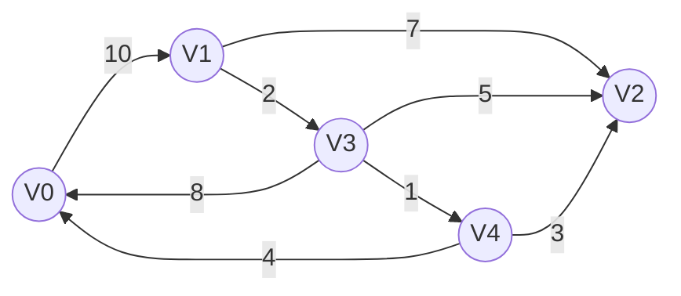

# Graph Algorithms


## Initial Setup
```cpp
// Defining the notion of Infinity
#define INF 1000000007

// For simplicity and will be used throughout
#define vi vector<int>
#define vvi vector<vi>

/*
 * @param {int} u: Starting vertex of the edge
 * @param {int} v: Ending vertex of the edge
 * 
 * Adds an edge from u to v
 */
void addEdge(int u, int v);
```


## Notation
```cpp
// Standard Notation of a directed graph is followed

int n; // Number of Vertices
int m;  // Number of Edges (in a directed environment)

// If m is the number of edges in an undirected graph,
//     2m will be the number of edges in the graph considered

// Assumption: vertices are ordered 0 to n-1

// edgesFrom[i] gives the list of all edges coming out of vertex i
vii edgesFrom(n);

// edgesInto[i] gives the list of all edges going to vertex i
vii edgesInto(n);
```

An example of a Sample Graph can be found in [SampleGraph.cpp](SampleGraph.cpp)




## BFS
```cpp
/*
 * Description:
 *  Finds whether a node can be reached from the start node
 * 
 * @param {int} start: The starting point of BFS;
 * @param {int} end [Optional] [Default = -1]: Terminates if end is reached
 * 
 * After execution
 * d[v] = INF if v can't be reached from start
 * d[v]: Minimum distance of v from u
 * 
 * p[v] = v IF v = start OR v can't be reached from start
 * p[v] = u implies u is the parent of u in the shortest path from start to v
 */
void bfs(int start, int end=-1);
```

```cpp
vi d(n, INF);  // d(v) is the distance of v from s
vi p(n);  // p(v) gives the parent of v in the graph
bfs(start);

// d and p are now updated after calling bfs and can be accessed
```

## DFS


## Kruskal's Algorithm (Minimum Spanning Tree)


## Prim's Algorithm (Minimum Spanning Tree)


## Dijkstra's Algorithm
```cpp

/* 
 * Description:
 * Finds the Shortest Path from a given vertex "start" to all the other vertices
 *  in a weighted graph. (Single Source Shortest Path)
 * 
 * @param {int} start: The starting point;
 * 
 * After execution
 * d[v] = INF if v can't be reached from start
 * d[v]: Minimum distance of v from u
 * 
 * p[v] = v IF v = start
 * p[v] = -1 IF v can't be reached from start
 * p[v] = u implies u is the parent of u in the shortest distance path from start to v
 */
void dijkstra(int start);
```

```cpp
vi dist(n, INF);  // dist[v] is the shortest distance of v from s
vi parent(n, -1);  // parent[v] is the parent of v in the shortest distance path
bfs(start);

// dist and parent are now updated after calling dijkstra and can be accessed
```